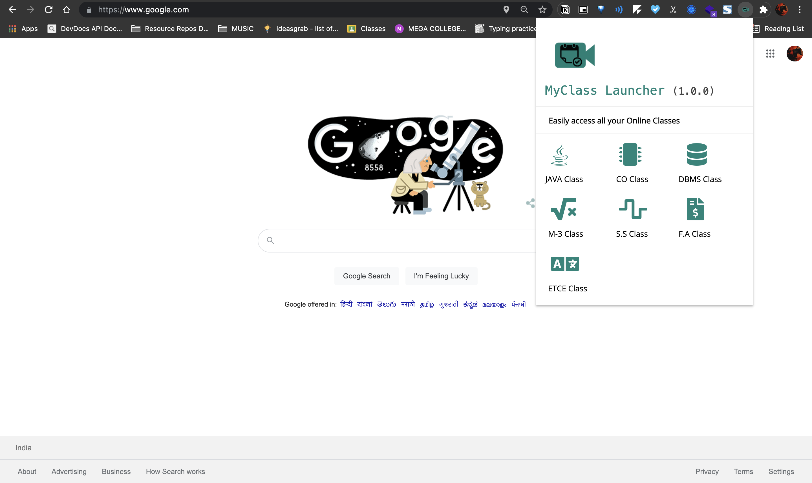

# MyClass_Launcher
## Created on Jun 12, 2021 
### I made this extension to join my Online Classes very quickly! 
#### Currently works only for my classmates!
CSE-3 (2019-23) MVSR Engineering College, Hyderabad, India
# Screenshot


# Continued Development
 Currently it is only static, I'll be adding more feature and will try to make it work for everyone by just adding your meet-links for once and will try to integrate it with your Google Calendar.

 Keep supporting me guys! 😅😊

___
## Author
## [@thefarazxr](https://www.github.com/thefarazxr)

## Acknowledgments
I would recommend everyone to take a **NOTE** on the go while building the prject and try to write a **JOUNRAL** of your Developmment journey so that it would help others and also you.

Because,
>## **Don't compare yourself with other instead compare yourself with your previous version.**

```
removed 

, "permissions": ["activeTab"]

from manifest.json 
```